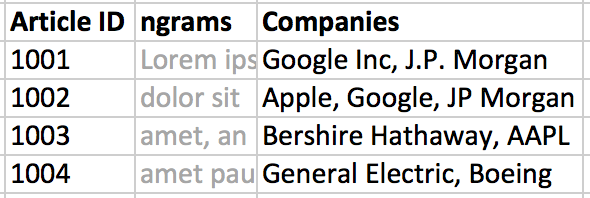

title: Text Mining with NLP
author:
  name: Ozzie Liu
  url: http://ozzieliu.com
output: basic.html
controls: true

--

### Exploring Text Mining and NLP with the Insurance Industry
#### Big Data News Analytics

Ozzie Liu
January 22nd, 2016
--

### Background

I had a chance to be a data science intern at a big insurance company and worked on some very interesting projects

Today's goals:
- Provide insight into data science in insurance
- Introduce Natural Language Processing

--

### How Do Insurance Companies Use Data Science?

* Auto Insurance
* Health Insurance
* Life Insurance
* Commercial Insurance
  * Flood and Property
  * Workers Compensation
  * Cybersecurity
  * Directors & Officers Liability

--

### Data Science vs. Actuarial Science

Actuary: Subset of statistics that focuses on insurance

There's a lot of overlap

But here's what I've found about data scientists
- Have skills to look at really big data sets...
- Bring practical perspective and insight in data interpretation
- Wield more models that can be potentially more accurate
- Scale faster and better

--

### Directors and Officers Insurance

... is a liability insurance payable to the directors and officers of a company, or to the organization(s) itself, as indemnification (reimbursement) for losses or advancement of defense costs in the event an insured suffers such a loss as a result of a legal action brought for alleged wrongful acts in their capacity as directors and officers. Such coverage can extend to defense costs arising out of criminal and regulatory investigations/trials as well; in fact, often civil and criminal actions are brought against directors/officers simultaneously...  
Source: [Wikipedia](https://en.wikipedia.org/wiki/Directors_and_officers_liability_insurance)

--

### Directors and Officers Insurance

Protection when a company's officers get sued.

- Security Class Action (SCA)
- Non-Security Class Action
  - Customers
  - Regulators
  - Competitors (anti-trust or unfair trade practices)

--

### Hypothesis

**Can we use news data to predict D&O non-SCA claims?**

Goal: Provide tool for underwriters to search news on a potential new customer
to gauge insurability and price premium factor

--

### Data available:

- All claims and details from past 15 years
- Rough industry averages
- News data - 100 million english news articles in 2 year period

--

### Approach

Simple enough: find all companies listed in news articles

Problems:
- That's a lot of articles!
- No predetermined list of companies to search for
- How can I tell if the articles are positive or negative?

--

### Constraints

News data was only a trial  
One month left  
I cannot keep raw text data

--

### Step 1 - Stopwords

Take out **stopwords**  
[and, or, if, but, to, the, a, you, we, I, they, it, be, not, that, this...]

*"Walmart announced Friday that it is closing 269 stores worldwide as it sharpens its focus on its supercenters and e-commerce business."*

Walmart announced Friday closing 269 stores worldwide sharpens focus supercenters e-commerce business.

--

### Step 1 - Stopwords - Limitations

*"To be or not to be that is the question  
Whether tis nobler in the mind to suffer"*

question whether nobler mind suffer

But what about:
- Bank **of** America
- Teach **for** America
- **The Who**
- **We** Work

--

### Step 1.5 - Named Entity Recognition

Ideal solution: [Named Entity Recognition (NER)](https://en.wikipedia.org/wiki/Named-entity_recognition)

*"Warren Buffett's Berkshire Hathaway said Monday it agreed to spend $37.2 billion for Precision Castparts -- the most it has ever paid for a company."* [[link]](http://money.cnn.com/2015/08/10/investing/buffett-berkshire-hathaway-precision-castparts/)

Warren Buffett's Berkshire Hathaway said Monday it agreed to spend $37.2 billion for Precision Castparts-- the most it has ever paid for a company.

--

### Step 2 - ngrams

**n-grams separates text in n word chunks**

*"To be or not to be that is the question"* in 2-grams:

[(to be), (be or), (or not), (not to), (to be), (be that), (this is), (is the), (the question)]

--

### Step 3 - Transforming Data

To look up articles from companies - transform from wide to long table

--
### Step 3 - Transforming Data

--

### Step 3.5 - Fuzzy Matching
Fuzzy Matching or approximate string matching is the technique of finding strings that match a pattern approximately. [[source]](https://en.wikipedia.org/wiki/Approximate_string_matching)
--

### Fuzzy matching - Edit (Levenshtein) Distance
Counts the number of edits from 1 string to another.

Edits are **insertion, deletion, or substitution**

**kitten → sitten** (substitution of "s" for "k")  
**sitten → sittin** (substitution of "i" for "e")  
**sittin → sitting** (insertion of "g" at the end)

Edit distance of 3
--

### Fuzzy matching - Jaccard Similarity

kitten = [ (ki), (it), (tt), (te), (en) ]  
sitting = [ (si), (it), (tt), (ti), (in), (ng) ]  
Jaccard index = 2/9

google = [ (go), (oo), (og), (gl), (le) ]  
google inc = [ (go), (oo), (og), (gl), (le), (ei), (in), (nc) ]  
Jaccard index = 5/8

--

### Fuzzy matching - Cosine Similarity

[ (go), (oo), (og), (gl), (le), (ei), (in), (nc) ]  
google = [1, 1, 1, 1, 1, 0, 0, 0]  
google inc = [1, 1, 1, 1, 1, 1, 1, 1]  

cosine similarity = 0.79

--

### Fuzzy matching - Cosine Similarity
Two vectors **a = [4,3], b = [4,0]**

--

### Big Data Application

Hadoop:
- HDFS - distributed file systems
- Pig - High level platform for using MapReduce
- Hive - Database engine based on SQL
- UDFs in Python

--

### NLTK
Robust Natural Language Toolkit package for Python

http://www.nltk.org/

**Natural Language Processing with Python**  
*by Steven Bird, Ewan Klein, and Edward Loper*  
http://www.nltk.org/book/

--

### Live demo
